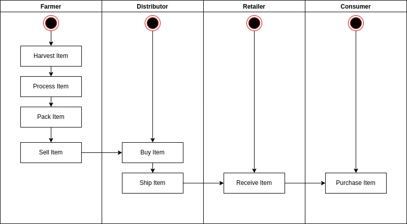
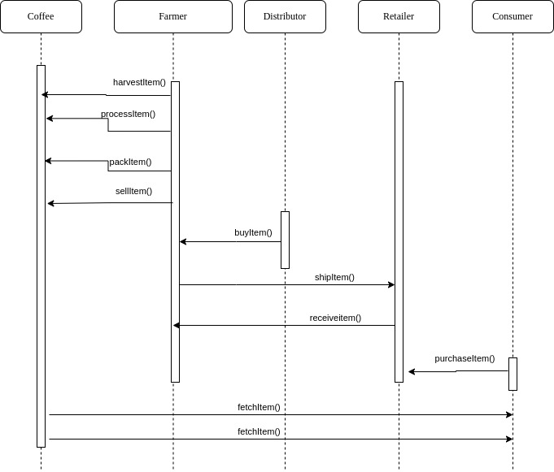
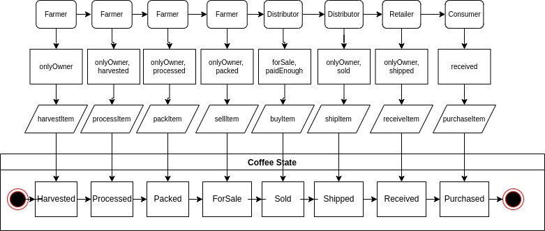
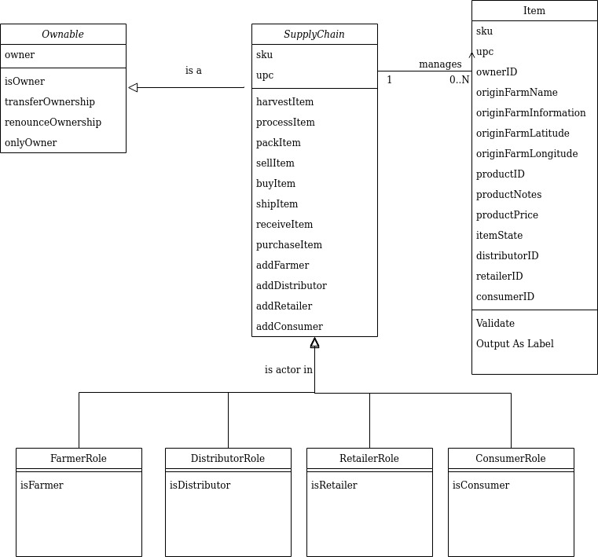

# Supply chain and data auditing

This project implements an Ethereum DApp to implement a simple coffee supply chain from farm to consumer. 

## Models
This application tracks the state of coffee through 4 actors:
* Farmer:  grows the coffee, processes the beans, packs for shipping and offers it for sale
* Distributor: buys coffee from farmer and sells to retailer
* Retailer : buys coffee from distributor for sale to the consumer
* Consumer : buys coffee from retailer

The following activity diagram illustrates the movement of coffee through these actors:

The following sequence diagram shows the contract invocations by these actors:

The following state diagram shows more clearly the contract invocations, as well as the prerequisites for each:

The following class diagram shows the contracts involved, as well as the structure of the Item used to represent each shipment of coffee:

## Running the DApp
The DApp for this project uses the Truffle accounts provided with the project files. The DApp is preconfigured to assign the following roles:
* Contract owner : account[0] (0x27d8d15cbc94527cadf5ec14b69519ae23288b95)
* Farmer : account[1] (0x018c2dabef4904ecbd7118350a0c54dbeae3549a)
* Distributor : account[2] (0xce5144391b4ab80668965f2cc4f2cc102380ef0a)
* Retailer : account[3] (0x460c31107dd048e34971e57da2f99f659add4f02)
* Consumer : account[4] (0xd37b7b8c62be2fdde8daa9816483aebdbd356088)

This project is deployed to the Rinkeby test network:
* Transaction ID : 0xde572be5bb3150b8a2e686d0de0e41c739330523dfc78b7656b925ce30f2a01a
* Contract ID : https://rinkeby.etherscan.io/address/0x1EfC04fd71CA5D70B30A261eAcbd6ACFd9108f01

To run this app locally:
* Start the ganache cli by running start-ganache-cli.sh script
* Bring up browser with Metamask installed.  Be sure that the accounts referenced above are installed in Metamask.
* Select contract owner account in Metamask
* Run "start-node.sh" to start app.
* As contract owner account, assign roles:
  - Click Add Farmer to assign Farmer role
  - Click Add Distributor to assign Distributor role
  - Click Add Retailer to assign Distributor role
  - Click Add Consumer to assign Consumer role
* Change to Farmer account in Metamask
* As farmer account:
  - Click Harvest to Harvest Item.  Click Fetch Data 1 button to verify that owner id is now the Farmer ID.
  - Click Process to process item
  - Click Pack to pack item
  - Click ForSale to mark item ready for sale
* Change to Distributor account in Metamask
* As distributor account:
  - Click Buy to buy item.  Click Fetch Data 1 button to verify that owner id is now the Distributor ID
  - Click Ship to ship item
* Change to Retailer account in Metamask
* As retailer account:
  - Click Receive to receive item.  Click Fetch Data 1 button to verify that owner id is now the Retailer ID
* Change to the Consumer account in Metamask
* As consumer account:
  - Click Purchase to purchase item.  Click Fetch Data 1 button to verify that owner id is now the Consumer ID
